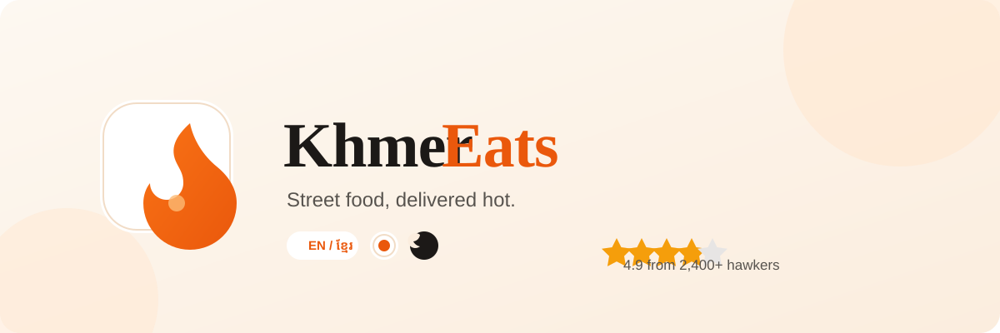
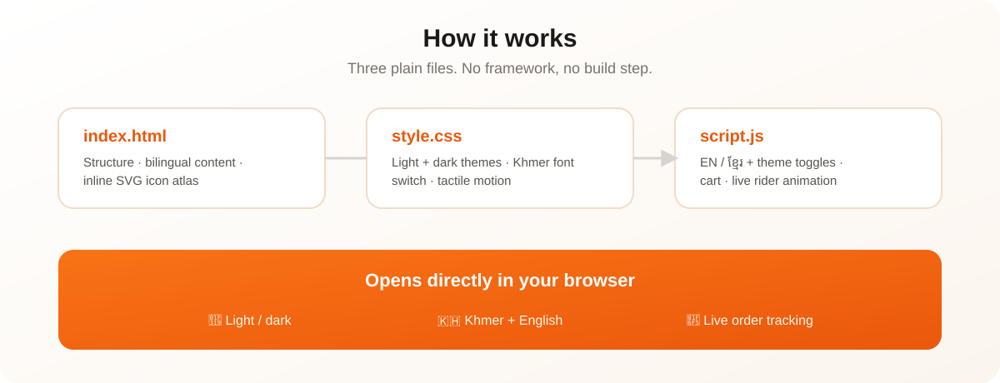

<p align="center">
  
</p>

<p align="center">
  <strong>Khmer street food, delivered hot to your door — a bilingual demo landing page in pure HTML, CSS &amp; JS.</strong>
</p>

<p align="center">
  
  
  
</p>

---

## ✨ Highlights

- 🌐 **Bilingual** — flip between English and Khmer (ខ្មែរ) with one click, including the Khmer font (Kantumruy Pro)
- 🌙 **Light & dark themes** — warm white by default, OLED black when you prefer; your choice is remembered
- 🛵 **Live order tracking** — a rider dot animates along a route with a real countdown, pure CSS + a few lines of JS
- 🧩 **Zero dependencies** — no framework, no build step, no install. Open it and it runs
- 🍜 **Real Khmer dishes** — Amok, Lok Lak, Nom Banh Chok, Kuy Teav and more, with a working cart counter

## 🚀 Quick Start

```bash
cd khmer-eats-demo
python3 -m http.server 8080
```

Then open **http://localhost:8080** in your browser. That's it.

> Why a local server and not a double-click? Some browsers block `file://` features (fonts, fetch). The Python server is built-in — nothing to install.

## 🏗️ How it works

<p align="center">
  
</p>

| File | Job |
|------|-----|
| `index.html` | Structure, bilingual content, inline SVG icon atlas |
| `style.css` | Light/dark themes, Khmer font switch, tactile motion |
| `script.js` | Language + theme toggles, cart, live rider animation |

No backend, no database, no API keys — everything runs in the browser.

## 🤖 AI Agent Context

This repo ships agent-friendly context files:

- `context/AGENT.md` — session handoff + project brain for AI coding tools

## 📄 License

[MIT](LICENSE) © 2026 Christpor
